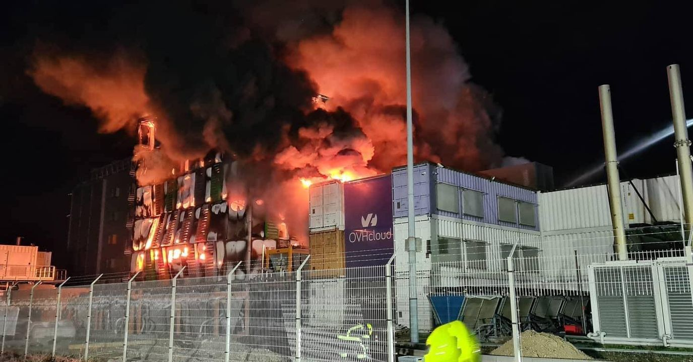

# Gedichte.com ist nicht erreichbar

Bei einem Gro&szlig;brand in den Rechenzentrum, in dem Gedichte.com untergebracht ist, wurde unser Server und vermutlich auch das auf einer getrennten Instanz untergebrachte Backup zerst&ouml;rt. 

Wie es weiter gehen wird, wei&szlig; ich derzeit nicht. Bald mehr.

Thies

Hier etwas mehr <a href="https://www.datacenterdynamics.com/en/news/ovh-fire-update-four-halls-sbg1-destroyed-well-all-sbg2/">Hintergr&uuml;nde</a>.

